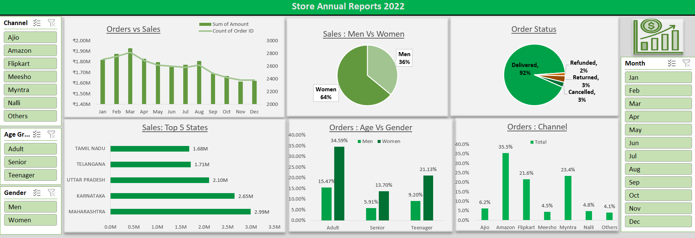

# 🛒 Store Annual Reports 2022 — Excel Dashboard

An interactive multi-channel retail dashboard analyzing 2022 store sales data — covering orders vs sales trends, gender-based analysis, top performing states, age-gender distribution and channel-wise performance with dynamic slicers.

---

## 📌 Dashboard Preview



---

## 📈 Visualizations

| Chart | Type | Insight |
|---|---|---|
| Orders vs Sales | Combo Chart (Bar + Line) | Monthly orders and revenue trend Jan–Dec |
| Sales: Men vs Women | Pie Chart | Women 64%, Men 36% |
| Order Status | Pie Chart | Delivered 92%, Returned 3%, Cancelled 3%, Refunded 2% |
| Sales: Top 5 States | Horizontal Bar | Maharashtra ₹2.99M leads, Karnataka ₹2.65M |
| Orders: Age vs Gender | Grouped Bar | Adult, Senior, Teenager breakdown by gender |
| Orders: Channel | Bar Chart | Amazon 35.5%, Myntra 23.4%, Meesho 21.6% |

---

## 🎛️ Interactive Slicers

| Slicer | Options |
|---|---|
| Channel | Ajio, Amazon, Flipkart, Meesho, Myntra, Nalli, Others |
| Age Group | Adult, Senior, Teenager |
| Gender | Men, Women |
| Month | Jan–Dec |

---

## 🔍 Key Insights

- **Women** contribute **64%** of total sales
- **Maharashtra** is the top performing state at ₹2.99M
- **Amazon** leads all channels at **35.5%** of orders
- **92%** of orders were successfully delivered
- **Adult** age group dominates orders for both genders

---

## 🗂️ Sheets Structure

| Sheet | Description |
|---|---|
| `Order Status` | Delivery, return, cancel analysis |
| `Top 5 States Sales` | State-wise revenue breakdown |
| `Age vs Gender Order` | Age group and gender distribution |
| `Channel wise Orders` | Platform-wise order analysis |
| `Dashboard` | Final interactive dashboard |

---

## 🛠️ Tech Stack

- **Tool:** Microsoft Excel
- **Features:** Pivot Tables, Pivot Charts, Slicers, Combo Charts, Conditional Formatting
- **Charts:** Combo Chart, Pie Chart, Horizontal Bar, Grouped Bar Chart

---

## 📁 Project Structure

```
excel-store-annual-report/
│
├── RavindraKumar_SalesData.xlsx   # Main Excel file
├── screenshots/
│   └── dashboard.png              # Dashboard preview
└── README.md                      # Project documentation
```

---

## 💡 What I Learned

- Building a multi-channel retail dashboard from raw sales data
- Analyzing gender, age group and regional sales patterns
- Creating a Combo Chart combining bar and line in one visualization
- Using multiple slicers simultaneously for dynamic filtering
- Extracting actionable insights from e-commerce order data

---
